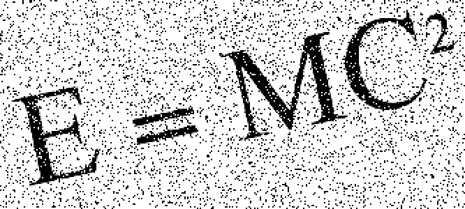
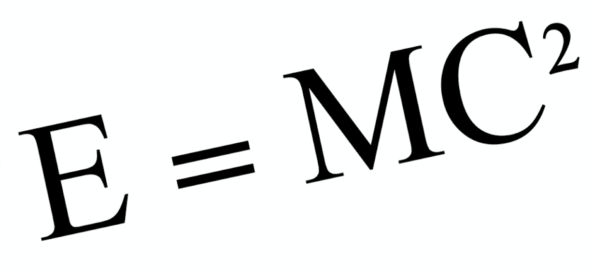
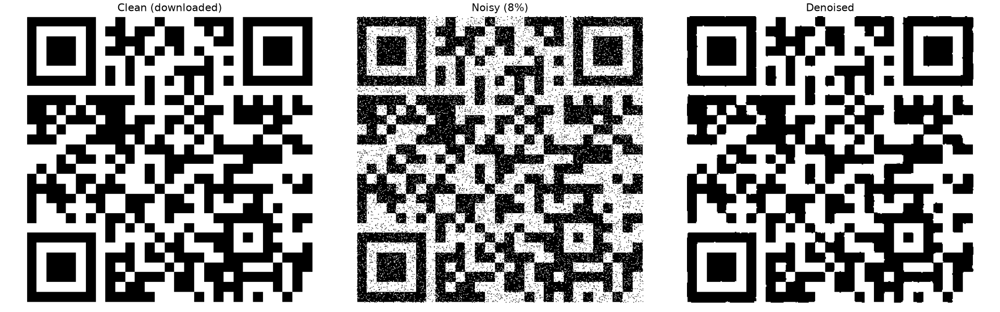
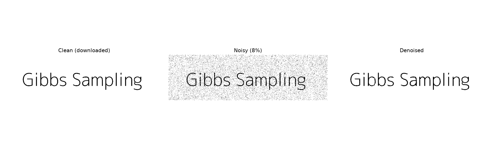

# Image Denoising using Gibbs Sampling

Restore a noisy **binary** image (black text/line-art on a light background, or
any bilevel image) by treating denoising as probabilistic inference on a
pairwise **Markov Random Field (MRF)** / **Ising model**, sampled with **Gibbs
sampling** — a Markov Chain Monte Carlo (MCMC) method.

| Noisy input | Denoised output |
|---|---|
|  |  |

## The model

Each hidden (clean) pixel `Y_i` and observed (noisy) pixel `X_i` take values in
`{-1, +1}`. The model assigns an energy to every configuration:

```
E(Y, X) = -eta  * Σ_i  Y_i · X_i          (data term: stay close to the observation)
          -beta * Σ_⟨i,j⟩ Y_i · Y_j        (smoothness term: agree with 4 neighbours)
```

The conditional posterior of a single pixel is

```
P(Y_i = +1 | neighbours, X_i) = sigmoid(2·w),
        w = eta·X_i + beta·(sum of Y over the 4 neighbours)
```

Gibbs sampling repeatedly redraws each pixel from this conditional. After a
**burn-in** period we average the samples to get each pixel's posterior mean and
threshold it at `0.5` (marginal-MAP estimate).

## What's in this repo

| File | Purpose |
|---|---|
| `denoise.py` | Self-contained CLI tool (denoise / add-noise / demo) |
| `Image denoising.ipynb` | Notebook demo that calls `denoise.py` and shows results inline |
| `Noisy.png`, `Denoised.png` | Bundled before/after example (E = MC²) |
| `requirements.txt` | Dependencies |

## Install

```bash
pip install -r requirements.txt
```

(Needs only NumPy + Pillow for denoising; matplotlib is used for the optional
plots.)

## Quick start

Run the bundled example end-to-end (writes results to `output/`):

```bash
python denoise.py demo
```

Denoise your own already-noisy image:

```bash
python denoise.py denoise path/to/noisy.png --energy-plot --compare
```

By default the result is saved next to the input as `noisy_denoised.png`, at the
image's **native resolution**.

## Testing on a variety of images

The denoiser expects a **bilevel** image. To try it on any clean image, first
corrupt it with the built-in noise generator, then denoise it:

```bash
# 1. Make a noisy version of a clean image (flip 10% of pixels)
python denoise.py noise my_logo.png --prob 0.1 --output my_logo_noisy.png

# 2. Denoise it and save a side-by-side comparison
python denoise.py denoise my_logo_noisy.png --compare
```

Good candidate images: scanned text, logos, line drawings, QR codes, fonts —
anything that is essentially black-and-white. Photographs and smooth-gradient
images are **not** a good fit for this binary model.

## Commands & options

```
python denoise.py denoise <input> [options]
  -o, --output PATH     output path (default: <input>_denoised.png)
  --eta FLOAT           data-term weight: trust in the observation (default 1.0)
  --beta FLOAT          smoothness weight: neighbour agreement (default 1.0)
  --burn-in N           burn-in sweeps, discarded (default 100)
  --samples N           posterior sweeps, averaged (default 1000)
  --threshold V         binarisation threshold in [0,1], or "auto" (Otsu, default)
  --invert              for light-on-dark images
  --seed N              random seed; -1 = nondeterministic (default 0)
  --energy-plot         also save the energy-convergence plot
  --compare             also save a noisy-vs-denoised comparison image
  --quiet               suppress per-step progress

python denoise.py noise <input> [--prob P] [--threshold V] [--invert] [-o PATH]
python denoise.py demo
```

### Tuning guide

| Symptom | Try |
|---|---|
| Output still noisy | increase `--beta` (e.g. `2`) or `--samples` |
| Thin strokes erased / over-smoothed | decrease `--beta` or increase `--eta` |
| Whole image one colour | add/remove `--invert`, or set `--threshold` manually |
| Too slow on big images | lower `--samples` (energy converges in ~50 sweeps) |

`eta` and `beta` are relative: a higher `beta/eta` ratio means stronger
smoothing (more weight on neighbours, less on the noisy observation).

## Features

- **Portable CLI** — denoise any image from the command line; no hard-coded paths.
- **Fast** — vectorised red/black (checkerboard) Gibbs sweeps, ~100× faster than
  a per-pixel Python loop.
- **Robust image loading** — handles RGB, RGBA, palette and grayscale inputs of
  any bit depth, with Otsu auto-thresholding by default.
- **Native-resolution output**, **reproducible** results (seeded RNG), and easy
  testing via the built-in noise generator and `demo` command.

## Results

Gibbs sampling reliably removes salt-and-pepper noise from bilevel images, even
at high noise levels (~20% flipped pixels), and the energy-convergence plot
shows the chain settling into a low-energy (clean) state within a few dozen
sweeps.

Below are two images downloaded from the web, corrupted with 8% salt-and-pepper
noise, then denoised (clean / noisy / denoised, left to right). Per-pixel
accuracy versus the clean original rises from ~92% in the noisy image to >99%
after denoising. Reproduce with the commands above using the files in
[`samples/`](samples).

**QR code** — pixel accuracy 92.1% → 99.3%



**Text** — pixel accuracy 92.1% → 99.8%


